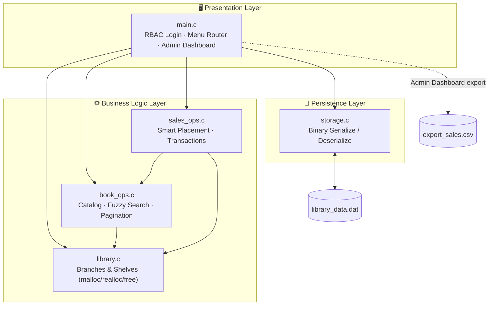
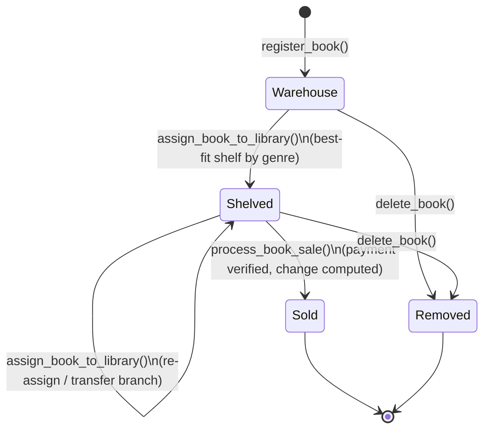

<div align="center">

# 📚 Chain Library Management System
### سیستم مدیریت کتابخانه زنجیره‌ای

**A role-based, multi-branch library engine — written from scratch in pure C99.**
Smart shelf placement · Fuzzy search · Sales analytics · Binary persistence · Zero external dependencies.

[](https://github.com/mxed04/library-management-system-c/actions/workflows/c-cpp.yml)
[](https://en.wikipedia.org/wiki/C99)
[](./LICENSE)
[](#-overview--problem-statement)
[](#️-build-run--prerequisites)
[](#-contributing)

</div>

---

## 📑 Table of Contents

1. [Overview & Problem Statement](#-overview--problem-statement)
2. [Key Features](#-key-features)
3. [System Architecture & Data Flow](#️-system-architecture--data-flow)
4. [Project File Structure](#-project-file-structure)
5. [Build, Run & Prerequisites](#️-build-run--prerequisites)
6. [Role Matrix & Default Login](#-role-matrix--default-login)
7. [Demo Scenarios & Sample Terminal Output](#-demo-scenarios--sample-terminal-output)
8. [Documentation](#-documentation)
9. [Known Limitations & Ideas for Contribution](#-known-limitations--ideas-for-contribution)
10. [License & Author](#-license--author)

---

## 📖 Overview & Problem Statement

Managing a **single** library is easy. Managing a **chain** of branches — each with its own shelves, capacities, and genres — while also tracking a master catalog, point-of-sale transactions, and change-making, is a genuinely different engineering problem.

This project is the final-term submission for **"Fundamentals of Computer and Programming"** (Term 1404), implemented entirely in **ANSI C (C99)** with **no external libraries** — every data structure, string routine, and file format is built by hand using only `stdio.h`, `stdlib.h`, `string.h`, and `ctype.h`.

The system models a real-world chain bookstore/library:

- 📦 A **Master Catalog** holds every book the chain owns.
- 🏢 Multiple **Library Branches**, each with multiple **Shelves**, hold physical copies.
- 🧠 A **smart placement algorithm** decides *which* shelf a book should land on.
- 💰 A **sales engine** verifies payment, computes change, and logs every transaction.
- 💾 The **entire system state** survives program restarts via binary serialization.
- 🔐 Four **role-based access levels** gate who can do what.

Every list in the system (`Book`, `Shelf`, `Library`, `User`, `SaleRecord`) is a dynamically-grown array — there are no fixed-size buffers, no hardcoded limits on branch/shelf/book counts, and all memory is explicitly managed with `malloc`, `realloc`, and `free`.

---

## ✨ Key Features

### 🔧 Core Engine

| Feature | Description | Implemented In |
|---|---|---|
| **Dynamic Memory Management** | Every collection (books, shelves, libraries, users, sales) grows via `realloc()` — no static arrays, no artificial caps. | `library.c`, `book_ops.c`, `sales_ops.c` |
| **Master Catalog vs. Physical Shelves** | A book always exists in the master catalog; it is considered **"in the warehouse"** until physically placed on a matching shelf. | `book_ops.c` |
| **Smart Shelf Placement Algorithm** | Automatically routes a book to the *fullest eligible shelf* (lowest free-capacity ratio) matching its genre — consolidating stock instead of spreading it thin. | `sales_ops.c` → `assign_book_to_library()` |
| **Sales & Transaction Engine** | Validates payment ≥ price, computes exact change, records a full transaction log, and removes the sold copy from both the shelf and the master catalog. | `sales_ops.c` → `process_book_sale()` |
| **Persistent Binary Storage** | The full system state — catalog, branches, shelves, and sales history — is serialized to `library_data.dat` on save/exit and restored on startup. | `storage.c` |

### 🏆 Senior-Level / Bonus Features

| Feature | Description | Implemented In |
|---|---|---|
| **Fuzzy Search** | Case-insensitive **subsequence** matching across Title, Author, and ISBN — type `"dn"` and still match `"Dune"`. | `book_ops.c` → `fuzzy_match()` |
| **Paginated Console UI** | Results render 20 per page with `[N]ext / [P]rev / [Q]uit` navigation, wrapped in ANSI-colored cards. | `book_ops.c` → `search_and_display_books()` |
| **Multi-Role Authentication (RBAC)** | Login gate supporting **Admin, Librarian, Seller,** and **User** roles, each with a distinct, cascading menu. | `main.c` → `authenticate_user()`, `has_permission()` |
| **Admin Analytics Dashboard** | Live ASCII bar charts (`████----`) of per-branch shelf utilization, automatic **overload warnings above 85%**, and one-click **CSV export**. | `main.c` → `ui_admin_dashboard()` |
| **GitHub Actions CI** | Every push/PR to `main` triggers an automated `make` build to catch compile errors early. | `.github/workflows/c-cpp.yml` |

---

## 🏗️ System Architecture & Data Flow

The codebase is split into clean layers: a **presentation layer** (the CLI), a **business logic layer** (branch/shelf/catalog/sales rules), and a **persistence layer** (binary I/O). Nothing outside `main.c` touches `stdio` for user interaction, and nothing outside `storage.c` touches the filesystem for state.



> 💡 **Design note:** Because collections are stored as flat arrays that get `realloc()`-ed on every insert, shelves store **Book values**, not pointers into the master catalog. Pointers into a `realloc()`-managed array can be invalidated the moment the array grows — storing by value trades a little memory duplication for guaranteed safety.

### 📦 Book Lifecycle



---

## 📂 Project File Structure

```text
.
├── .github/
│   └── workflows/
│       └── c-cpp.yml            # CI: runs `make` on every push/PR to main
├── docs/
│   └── Project_Documentation.pdf   # Full academic report & design write-up
├── include/
│   ├── book_ops.h                # Catalog, fuzzy search & pagination API
│   ├── library.h                  # Branch & shelf memory management API
│   ├── models.h                    # Struct/enum definitions (Book, Shelf, Library, User, SaleRecord)
│   ├── sales_ops.h                  # Smart placement & transaction API
│   └── storage.h                     # Binary persistence API
├── src/
│   ├── book_ops.c                # Fuzzy search, pagination, warehouse logic
│   ├── library.c                  # Dynamic branch/shelf allocation
│   ├── main.c                      # CLI entry point, RBAC menu, Admin dashboard
│   ├── sales_ops.c                  # Smart shelf placement + sales engine
│   └── storage.c                     # Binary save/load (serialization)
├── data/                          # ⚙️ generated at build/run time — gitignored
│   ├── library_data.dat            # Auto-created binary database
│   └── export_sales.csv             # Created on demand via Admin Dashboard export
├── .gitignore
├── LICENSE
├── Makefile
└── README.md
```

> **Note:** `data/` is **not** committed to the repository — the `Makefile` creates it automatically (`mkdir -p data`), and both `.dat` and `.csv` files inside it are ignored via `.gitignore` since they are runtime-generated, per-machine state.

---

## ⚙️ Build, Run & Prerequisites

The project has **zero external dependencies** — only a C99-capable compiler and `make`.

### 🐧 Linux

```bash
# 1. Install prerequisites (Debian/Ubuntu example)
sudo apt update && sudo apt install build-essential -y

# 2. Clone & enter the repo
git clone https://github.com/mxed04/library-management-system-c.git
cd library-management-system-c

# 3. Build (creates ./data and the `libman` binary)
make

# 4. Run
./libman

# Optional: remove the compiled binary
make clean
```

### 🪟 Windows

> Windows has no native `gcc`/`make` — use **MSYS2** (recommended) or **MinGW-w64** with Git Bash.

```bash
# 1. Install MSYS2 (https://www.msys2.org/), then in the "MSYS2 MinGW64" terminal:
pacman -S mingw-w64-x86_64-gcc make git

# 2. Clone & enter the repo
git clone https://github.com/mxed04/library-management-system-c.git
cd library-management-system-c

# 3. Build & run
make
./libman.exe
```

> 🎨 **ANSI colors on Windows:** the UI prints raw ANSI escape codes with no fallback detection. Use **Windows Terminal**, **PowerShell 7+**, or a recent `cmd.exe` (Windows 10 1909+, which supports VT100 sequences natively) to see the colored cards and charts correctly. Older legacy consoles will show raw escape sequences instead of colors.

| Requirement | Version / Notes |
|---|---|
| Compiler | GCC (or any C99-compliant compiler) |
| Build tool | GNU Make |
| Standard | `-std=c99` (enforced in `Makefile`) |
| Warnings | Compiled clean with `-Wall -Wextra`, zero warnings |
| Dependencies | **None** — only the C standard library |

---

## 🔐 Role Matrix & Default Login

Authentication is username/password based, checked against an in-memory `User` list. On the **very first run**, the system auto-creates a default administrator:

| Field | Value |
|---|---|
| Username | `admin` |
| Password | `1234` |
| Role | `ROLE_ADMIN` |

> ⚠️ **Security note:** these are development/demo credentials from a coursework project — the current codebase has no in-app password-change or user-registration screen, so treat this as a starting point, not production-hardened auth.

Roles form a **privilege hierarchy** (`Admin > Librarian > Seller > User`), and a more senior role automatically inherits every permission of the roles beneath it:

| Menu Action | Option # | Admin | Librarian | Seller | User |
|---|:---:|:---:|:---:|:---:|:---:|
| Add Book | 1 | ✅ | ✅ | ❌ | ❌ |
| Search Book (Fuzzy & Paginated) | 2 | ✅ | ✅ | ✅ | ✅ |
| Delete Book | 3 | ✅ | ✅ | ❌ | ❌ |
| Display Warehouse Stock | 4 | ✅ | ✅ | ✅ | ✅ |
| Assign Book to Library (Smart Placement) | 5 | ✅ | ✅ | ❌ | ❌ |
| Sell Book | 6 | ✅ | ✅ | ✅ | ❌ |
| View Sold Books History | 7 | ✅ | ❌ | ❌ | ❌ |
| Save Current Data | 8 | ✅ | ✅ | ✅ | ✅ |
| Exit | 9 | ✅ | ✅ | ✅ | ✅ |
| Admin Analytics Dashboard & CSV Export | 10 | ✅ | ❌ | ❌ | ❌ |

---

## 🎬 Demo Scenarios & Sample Terminal Output

The following output was captured from an actual build of the program (`make && ./libman`) — nothing here is fabricated.

**1. Login & the role-aware main menu (as `admin`):**

```text
Init: Default Admin created (admin/1234)

========================================
        SYSTEM LOGIN REQUIRED
========================================
Username (or 'exit'): admin
Password: 1234

Login Successful! Welcome, admin.

Main Menu - Logged in as: admin

1. Add Book
3. Delete Book
5. Assign Book to Library
2. Search Book (Fuzzy & Paginated)
4. Display Stocked Books
6. Sell Book
7. View Sold Books History
10. Admin Analytics Dashboard & CSV Export
8. Save Current Data
9. Exit

Enter your choice: 1

--- Add New Book ---
Title: Dune
Author: Frank Herbert
Publisher: Ace Books
Genre: Fiction
ISBN: ISBN-001
Price: 15.99
Success: Book added to Warehouse.
```

**2. Smart placement + the Admin Analytics Dashboard:**

```text
--- Assign Book to Library ---
Enter Book ISBN: ISBN-001
[1] Central Library
Select Library ID: 1
Success: Book placed via smart priority.

=== ADMIN ANALYTICS DASHBOARD ===
Total Branches   : 2
Master Catalog   : 1 books
Total Sales      : 0 transactions

--- Branch Capacity (ASCII Chart) ---
Central Library | █------------------- 1/13
North Branch    | -------------------- 0/6
```

**3. Selling a book (automatic change calculation) + CSV export:**

```text
--- Sell Book ---
[1] Central Library
[2] North Branch
Enter Branch ID: 1
Enter ISBN of book to buy: ISBN-001
Enter Buyer Name: Ali Rezaei
Enter Paid Amount: $20

Sale completed! Change: $4.01
```

`export_sales.csv` generated by option `10 → 1`:

```csv
Buyer,Book Title,ISBN,Library,Price,Paid,Change
Ali Rezaei,Dune,ISBN-001,Central Library,15.99,20.00,4.01
```

---

## 📄 Documentation

The complete academic write-up — problem statement, design rationale, and implementation notes — is available at:

📘 **[`docs/Project_Documentation.pdf`](./docs/Project_Documentation.pdf)**

---

## 🧭 Known Limitations & Ideas for Contribution

Being transparent about the current edges of the system — these are also great **first-contribution** opportunities:

- 👤 **No in-app user management:** the `User` / `UserRole` model and RBAC engine fully support Librarian, Seller, and User accounts, but there is currently no menu flow to *create* them — only the default `admin` exists out of the box.
- 💾 **User accounts aren't persisted:** `save_system_to_file()` / `load_system_from_file()` only serialize the book catalog, branches/shelves, and sales history — not the `users` array. Adding this would be a natural follow-up once user registration exists.
- 🧱 **Explicit zero-init for `create_system()`:** on a brand-new system (no `library_data.dat` yet), `sale_count`/`sales`/`user_count`/`users` currently rely on freshly-`malloc`'d heap memory happening to read as zero, rather than being explicitly set — hardening `create_system()` with explicit zero-initialization would remove that assumption.
- 🏷️ **Menu label vs. behavior:** option `4` is labeled *"Display Stocked Books"* but calls `display_warehoused_books()`, which actually lists **unassigned warehouse inventory** (books not yet on any shelf) — a clarifying rename or a companion "view shelved books" view would remove the ambiguity.

Pull requests addressing any of the above are very welcome — see [Contributing](#-contributing) below.

---

## 🤝 Contributing

1. Fork the repository and create a feature branch.
2. Make your changes, keeping the `-Wall -Wextra -std=c99` build **warning-free**.
3. Open a Pull Request against `main` — the CI workflow will automatically build your branch.

---

## 📜 License & Author

<div align="center">

Distributed under the **MIT License**. See [`LICENSE`](./LICENSE) for the full text.

**Author:** Mohammad Afra ([@mxed04](https://github.com/mxed04))
Final-term project for *Fundamentals of Computer and Programming* — Term 1404

⭐ If this project helped you learn something about C, memory management, or systems design, consider starring the repo!

</div>